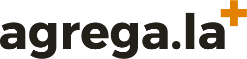

# Agrega.la (http://agrega.la)

## Resumen
Agrega.la es una red presente en Brasil, Argentina, Colombia y México, que tiene como objetivo promover la visibilización de contenidos y acciones entre medios independientes, libres o comunitarios. Su plataforma digital constantemente hace copias de los posts publicados en Facebook (FB) de todos los grupos registrados; así reúne sus contenidos en un mismo espacio común y realiza continuamente una migración de datos de una plataforma cerrada y privativa para otra abierta y libre. En ella los usuarios que no tienen registro en FB pueden acceder a los contenidos de los medios libres. Además, Agrega.la también reúne contenidos de blogs por medio de RSS y Twitter.

La plataforma tecnológica Agrega.la - http://agrega.la - funciona con una instalación de Wordpress-MU (multisite) con un template personalizado y un Plugin programado para extraer contenidos públicos de páginas y grupos de Facebook, que también debe instalarse.

Los nuevos sitios / blogs creados, a partir de un recorte geográfico o temático, funcionarán como un sitio/blog dentro del Wordpress-MU. Por ejemplo, el sitio http://agrega.la/rio/ es el capítulo de Río de Janeiro dentro de Agrega.la.

Este repositorio GIT está organizado de la siguiente manera:
* Repositorio del sitio (raíz) Agregación: Template Wordpress-MU personalizado: https://github.com/Agregala/agregala-home
* Repositorio del Template Wordpress personalizado de los sitios / capítulos locales: https://github.com/Agregala/agregala-site
* Repositorio del Plugin Facebook a Wordpress: https://github.com/Agregala/egany_facebook_to_wordpress

## Objectivos del Proyecto
visualizar y fortalecer la labor de los colectivos y medios que trabajan de forma autogestionada e independiente para producir su propia información, la cual no tiene la misma difusión e impacto que la de los medios masivos o tradicionales de su ciudad o territorio.
descentralizar la web y romper la hegemonía de las redes sociales teniendo en cuenta que la mayoría de estos colectivos y medios, para compartir sus contenidos, hacen uso de sitios como Facebook, condicionados por los criterios de una empresa privada. 

## Apresentación
Es una herramienta social y colaborativa  que permite que la diversidad de contenidos alternativos que están por fuera de los medios tradicionales pueda presentarse desde un mismo espacio para cobrar más fuerza y visibilidad, mostrando la realidad que no se ve. 
Este proyecto propone la descentralización de la web, rompiendo la hegemonía de las redes sociales y empoderando a las personas, En la actualidad mucha de la información se concentra en sitios como Facebook, Twitter, Instagram, lo que hace que las publicaciones dependan de los criterios de una empresa privada. La reunión de los contenidos en la plataforma contribuye a compilar, difundir y fortalecer nuestra memoria uniendo voces comunitarias y locales de las iniciativas y colectivos de comunicación que desde los blogs, posteos de fanpages, tweets, etc, se incorporan automáticamente. 
Lo que cada colectivo pública en la web se compila en Agrega.la, así los seguidores de un medio pueden conocer otros y además la plataforma permite buscar por temas generando a los creadores de los medios memoria de los contenidos que publican.

## Tecnologia
Desde lo tecnológico no implica por parte de los colectivos un esfuerzo o trabajo extra, por lo que la plataforma toma y replica de manera automática los contenidos que publican en sus propias redes, webs y blog. Tampoco quita o resta el tráfico a sus plataformas de origen, debido a que la réplica tiene un link a ellos, con lo cual beneficia también a las audiencias al poder acceder desde una misma plataforma a distintos medios independientes.
Agrega.la surge como una plataforma digital de libre acceso que reúne contenidos producidos por estes colectivos. Los principales contenidos de páginas web, blogs, fanpages o redes sociales pertenecientes a estos medios y colectivos, se trasladan y son migrados de forma automática a Agrega.la. De este modo, la información se unifica en un mismo espacio, lo cual simplifica la identificación en la web tanto de los colectivos/medios como de los contenidos que producen.

## Contexto de la creacion y problemas a resolver
Vivimos en un contexto de concentración mediática, donde las tecnologías digitales significan para muchas iniciativas y colectivos de comunicación y cultura, la posibilidad de producir y distribuir sus propios contenidos sin intermediarios a través de sus blogs y redes sociales. Estos nuevos relatos políticos, sociales y culturales que surgen desde la mirada y la cotidianeidad de nosotros mismos, los ciudadanos, no circulan de forma masiva ni los vemos en los medios de comunicación tradicionales. Se encuentran dispersos en la web, perdiendo fuerza e impacto ante la sobreabundancia de información y en plataformas (como las redes sociales) donde el acceso no es libre y no garantizan el cuidado de nuestra memoria.

### Problema a resolver
Los medios de comunicación tradicionales no se acercan a la realidad local. Son los medios comunitarios quienes producen contenidos próximos a los entornos en los que se crean, conociendo la región desde la proximidad, es un cubrimiento desde lo cercano a las problemáticas y logros de las comunidades.
La accesibilidad de Facebook como una opción para el aprovechamiento de internet es peligrosa. En general, los usuarios de esta red social no son conscientes que Facebook controla la información que se publica, ya que como empresa privada puede bloquear y desaparecer con este contenido -que construye la memoria colectiva- si no responde a las lógicas y condiciones de negocio aparentemente libres.  
Existe en la actualidad una amplia producción de contenidos mediáticos e independientes gracias al conocimiento y aprovechamiento de Tecnologías de la Información y las Comunicaciones (TIC). Los colectivos publican para nichos precisos pero tienen poca visibilidad e impacto por el tamaño de estas iniciativas y por la precariedad de recursos que tienen para dar a conocer su propuesta comunicativa.
Muchas veces, las personas que lideran medios y colectivos de comunicación independientes no se conocen entre ellos y por eso no pueden generar propuestas conjuntas. Son diversas y plurales las iniciativas ciudadanas que se plantean informar desde lo local, pero no existe una red conformada que dé a conocer cuántos, cuáles y de qué tipo son los colectivos.
Acceder a información de colectivos o medios independientes es un proceso complejo. Las personas que buscan este tipo de información no pueden encontrarla con facilidad porque los contenidos están dispersos en diferentes sitios en la web (Facebook, twitter, blogs), lo cual hace que la búsqueda muchas veces sea inútil.

## Historia del Proyecto
En este proyecto tuvo su primera versión en Brasil em 2013/2014, cuando se vivieron grandes protestas en Rio de Janeiro, momento en el que los grandes medios informaron de forma parcializada los hechos y movilizaciones de los ciudadanos inconformes con diversas violaciones de derechos humanos. Así, muchos grupos y colectivos de medios independientes empezaron a actuar, produciendo sus propios relatos y contenidos. Con eso, fue posible ampliar la pluralidad de voces. Sin embargo, muchos de estos nuevos medios se quedaron rehenes de Facebook, al adoptar un uso exclusivo de esta plataforma. Agrega.la emerje neste primero momento como un respuesta a este problema.
Posteriormente en 2016, en el marco del III Laboratorio Iberoamericano de Innovación Ciudadana 2016 (LABIC) en Cartagena de Indias, Colombia, Agrega.la inicia una nueva etapa, ampliando su enfoque para otros países de América Latina. La idea original se complementó con el trabajo de 10 personas de diferentes países de iberoamérica y con la  participación de los colectivos de comunicación de la región Caribe en Colombia. Entre ellos la región del Caribe colombiano, Argentina o México. Ahora, la plataforma gaña la capacidad de abrigar distintas ciudades, como subsítios o capítulos locales. Hoy tenemos operantes 4 subsitios, con dezenas de medios cadastrados:

* agrega.la/caribe
* agrega.la/mesomexico
* agrega.la/rio
* agrega.la/rosario

## Potencialidades:
Agrega.la contribuye a compilar, difundir y fortalecer nuestra memoria uniendo voces comunitarias, creando redes que permitan fortalecer los distintos colectivos de comunicación en cada región. Los ciudadanos podemos acceder a otro tipo de contenidos que narran nuestra región, conocer mejor nuestro entorno, apreciar otras realidades y tomar decisiones, para un empoderamiento de lo que las personas quieren contar.
Además permite constituir una gran red que nos permita fortalecer la libertad de expresión y el derecho a la información que genere una opinión pública mejor informada y crítica capaz de asumir los desafíos de las realidades de los países donde vivimos.
Permite que el publico de medios locales conozcan lo que generan otros colectivos de comunicación, que accedan a información que no se publica en los medios masivos de información. permite realizar investigación ciudadana, científica o periodística desde los aconteceres locales. 

## Memoria na Web y promoción de reds entre coletivos de medios alternativos
Agrega.la facilita también la posibilidad de generar redes locales, regionales y a nivel latinoamérica entre distintos colectivos, conocerse y reconocerse, establecer relaciones y posibilidades de trabajo en conjunto que permitan potenciarlos frente a los grupos y las grandes corporaciones mediáticas.
Agrega.la colabora para fortalecer algunas fragilidades frecuentes entre los medios libres. Cuando automatizamos la colecta y almacenamiento de contenidos originarios de redes sociales propietarias (Facebook), por ejemplo, estamos desarrollado un acervo de memoria colectiva de nuestro tiempo presente. Ya se han dado casos en donde son borradas páginas de medios libres o comunitarios en Facebook. en tal situación, nuestra plataforma es una alternativa confiable y autogestionada de memoria de los medios libres en América Latina, por lo que están agregados en una sola base de datos. Es posible hacer búsquedas entre contenidos, indexando o localizando por temas la producción de estos grupos. Colectivos de países como Colombia, Brasil, México y Argentina hacen parte de esta plataforma, agregando contenidos regionales desde donde hay redes. Logrando visibilizar la información que los medios tradicionales se les frecuenta no publicar. 

# Theme instalación
- [Wordpress](https://wordpress.org/) - Descargar wordpress.
- Descarga y activar el theme en la carpeta de themplates.

## Contribuidores 
[belisards](https://github.com/belisards)
[rdrouaillet](https://github.com/rdrouaillet)

## License

